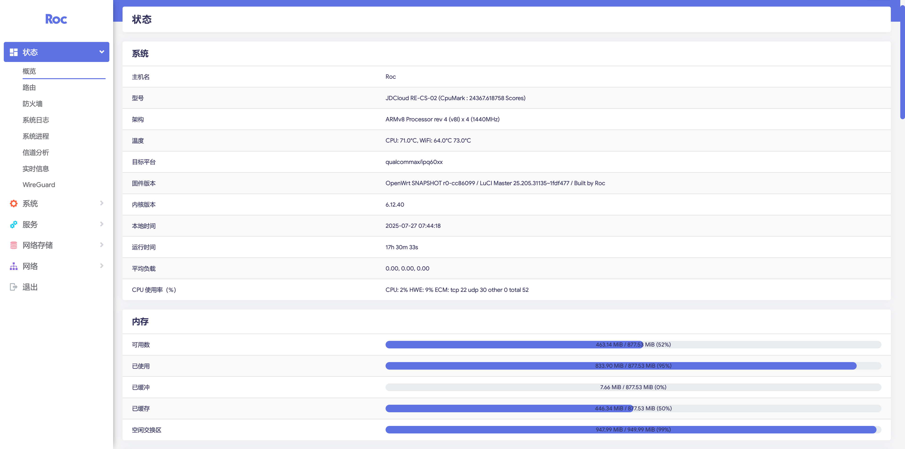
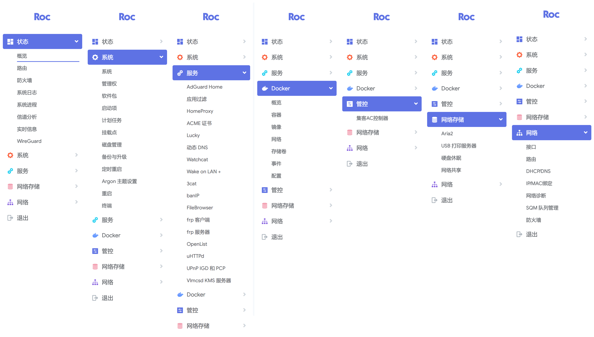

<h1>OpenWrt — 云编译</h1>

## 特别提示

- **本人不对任何人因使用本固件所遭受的任何理论或实际的损失承担责任！**

- **本固件禁止用于任何商业用途，请务必严格遵守国家互联网使用相关法律规定！**

## 项目说明
- 固件默认管理地址：**`192.168.2.1`** 默认用户：**`root`** 默认密码：**`none`**
- 源码来源：[breeze303](https://github.com/LiBwrt-op/openwrt-6.x) [VIKINGYFY](https://github.com/VIKINGYFY/immortalwrt)
- 云编译来源：[haiibo](https://github.com/haiibo/OpenWrt) [视频教程](https://www.youtube.com/watch?v=6j4ofS0GT38&t=507s)

## 仓库说明
- 本人Fork的仓库：[OpenWrt](https://github.com/laipeng668/openwrt) [Immortalwrt](https://github.com/laipeng668/immortalwrt) [LibWrt](https://github.com/laipeng668/openwrt-6.x)，大体内容一致。
- `OpenWrt`追新，第一时间同步上游；`Immortalwrt`和`LibWrt`相互印证（通过rebase和merge进行更新）。
- `LibWrt`因为DTS更为丰富，所以支持更多的机型。

## 定制固件
1. 首先要登录 Gihub 账号，然后 Fork 此项目到你自己的 Github 仓库
2. 修改 `configs` 目录对应文件添加或删除插件，或者上传自己的 `xx.config` 配置文件
3. 插件对应名称及功能请参考恩山网友帖子：[OpenWrt软件包全量解释](https://www.right.com.cn/FORUM/forum.php?mod=viewthread&tid=8384897)
4. 如需修改默认 IP、添加或删除插件包以及一些其他设置请在 `Roc-script.sh` 文件内修改
5. 添加或修改 `xx.yml` 文件，最后点击 `Actions` 运行要编译的 `workflow` 即可开始编译
6. 编译大概需要1-2小时，编译完成后在仓库主页 [Releases](https://github.com/laipeng668/openwrt-ci-roc/releases) 对应 Tag 标签内下载固件

